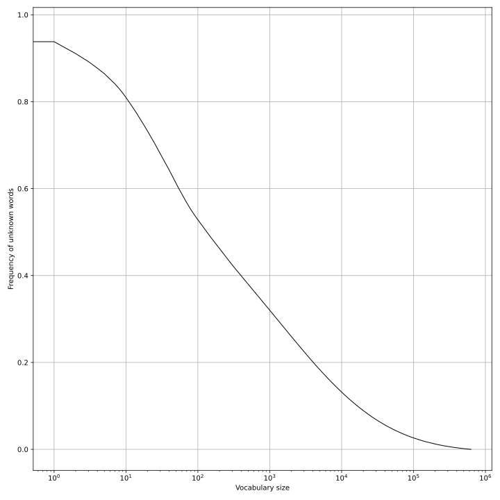

# DeckGenerator
AI-powered generator of Anki decks for language learning.


## Card format
It's very simple. Each word X will generate several sentences which contain it. And each sentence will spawn two cards.

First one:
```
German sentence + audio
===============================
English translation + audio
```

And the reverse:
```
English translation + audio
===============================
German sentence + audio
```

No definitions, grammar information or other extras. The idea is that you can easily learn all the useful information from these diverse usage examples, without having to memorise declension tables and other boring material.

## Installation and usage
Install poetry and do `poetry update`.
Additionally, install German module for spaCy:
```bash
python -m spacy download de_core_news_md
```

The generation process:
1. `python word_list.py` will produce `words_de.txt` which contains words in their basic form and their frequencies.
2. `python sentence_examples.py --vocab_size N` will create examples sentences with the first `N` words, 3-6 sentences with each typically. You can select GPT version in `sentence_examples.py`. The produced file is `results.json`.
3. `python audio.py` will use OpenAI TTS to generate audio for each sentence to the folder `audio`, skipping already generated ones.

( Pulling the files from Git and unpacking [audio.zip](https://drive.google.com/file/d/1H5JTlBlZN8R7jZqMHfOmgrma_p0AUBcx/view?usp=sharing) should take you to this step )

4. `python build_deck.py --n_pairs N` will take first `N` sentence pairs and package them into `.apkg` file, which can be imported by Anki.

## How many words are needed?
German:
